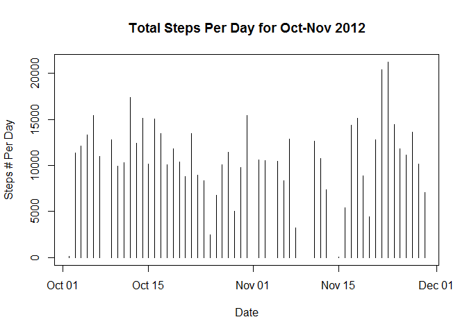
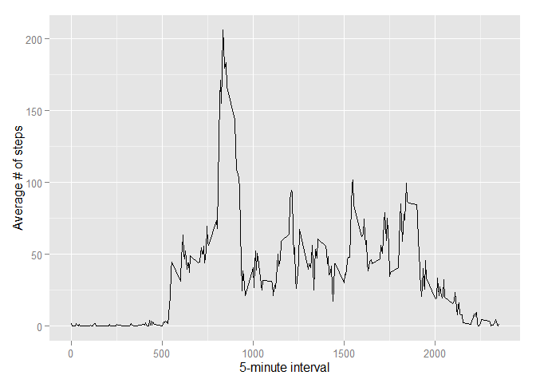
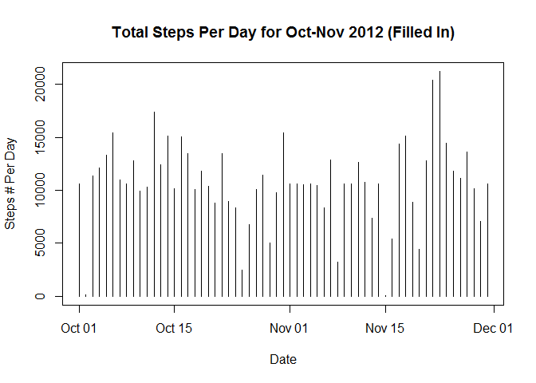
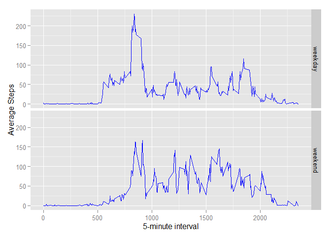

# Reproducible Research: Peer Assessment 1

## Loading and preprocessing the data

```
## 
## Attaching package: 'dplyr'
## 
## The following object is masked from 'package:stats':
## 
##     filter
## 
## The following objects are masked from 'package:base':
## 
##     intersect, setdiff, setequal, union
```


```r
# Clean up workspace
rm(list=ls())

# Set working directory
setwd("C:\\Users\\Moira\\RepData_PeerAssessment1")

# check to see if data directory exists if not create
if (!file.exists("data")){
  dir.create("data")
}

# upzip the file into the data directory
df <- unzip("activity.zip", exdir = "data")

# -----------Loading and preprocessing the data
df_data <- read.csv(file="./data/activity.csv",head=TRUE, sep=",")
# convert date to date format
df_data$date = as.Date(df_data$date, "%Y-%m-%d")
str(df_data)
```

```
## 'data.frame':	17568 obs. of  3 variables:
##  $ steps   : int  NA NA NA NA NA NA NA NA NA NA ...
##  $ date    : Date, format: "2012-10-01" "2012-10-01" ...
##  $ interval: int  0 5 10 15 20 25 30 35 40 45 ...
```

## What is mean total number of steps taken per day?

```r
# 1. sum the total steps by date 
df_totalsteps <- aggregate(steps~date, df_data, sum, na.rm=TRUE)

# 2. create a basic histogram on total steps per day
plot(df_totalsteps,type='h',
     main = "Total Steps Per Day for Oct-Nov 2012",
     xlab="Date",
     ylab="Steps # Per Day")
```

 

```r
# 3.Calculate and report the mean and median of the total number of steps taken per day
meansteps <-mean(df_totalsteps$steps)
meansteps <- as.integer(round(meansteps, digits = 0))
mediansteps <- median(df_totalsteps$steps) 
meansteps
```

```
## [1] 10766
```

```r
mediansteps 
```

```
## [1] 10765
```
The mean total number of steps taken per day = 10766.  
The median total number of steps taken per day = 10765.

## What is the average daily activity pattern?

```r
df_avgsteps <- aggregate(steps ~ interval , data=df_data, mean)

ggplot(data=df_avgsteps, aes(x=interval, y=steps)) +
  geom_line() +
  xlab("5-minute interval") +
  ylab("Average # of steps")
```

 

```r
# find the interval that represent the max steps
df_avgsteps[which.max(df_avgsteps$steps), ]
```

```
##     interval    steps
## 104      835 206.1698
```
The 5-minute interval, which contains the maximum number of steps is 835

## Imputing missing values

```r
#1. missing values
NAvaluecount <- sum(is.na(df_data$steps))
```
The number of missing values in the data is 2304.


```r
#2. fill in missing values in data frame and create a new dataframe
# merge two data frames by ID
df_datamerge <- merge(df_data,df_avgsteps,by="interval")
# make the step column an int to match x column
df_datamerge$steps.y <- as.integer(df_datamerge$steps.y)
# fill in the NA
df_datamerge <- transform(df_datamerge, steps.x = ifelse(is.na(steps.x), steps.y, steps.x ))

# 3. create the new clean df
df_datafilled <- select(df_datamerge, interval,steps=steps.x, date )
summary(df_datafilled)
```

```
##     interval          steps             date           
##  Min.   :   0.0   Min.   :  0.00   Min.   :2012-10-01  
##  1st Qu.: 588.8   1st Qu.:  0.00   1st Qu.:2012-10-16  
##  Median :1177.5   Median :  0.00   Median :2012-10-31  
##  Mean   :1177.5   Mean   : 37.33   Mean   :2012-10-31  
##  3rd Qu.:1766.2   3rd Qu.: 27.00   3rd Qu.:2012-11-15  
##  Max.   :2355.0   Max.   :806.00   Max.   :2012-11-30
```


```r
#4. histogram of the total number of steps taken each day
# sum the total steps by date 
df_totalsteps_filled <- aggregate(steps~date, df_datafilled, sum, na.rm=TRUE)
str(df_totalsteps_filled)
```

```
## 'data.frame':	61 obs. of  2 variables:
##  $ date : Date, format: "2012-10-01" "2012-10-02" ...
##  $ steps: int  10641 126 11352 12116 13294 15420 11015 10641 12811 9900 ...
```

```r
# create a basic histogram on total steps per day
plot(df_totalsteps_filled,type='h',
     main = "Total Steps Per Day for Oct-Nov 2012 (Filled In)",
     xlab="Date",
     ylab="Steps # Per Day")
```

 


```r
# Calculate and report the mean and median of the total number of steps taken per day
meansteps_filled <-mean(df_totalsteps_filled$steps)
meansteps_filled <- meansteps <- as.integer(round(meansteps_filled, digits = 0))
mediansteps_filled <- median(df_totalsteps_filled$steps)
meansteps_filled
```

```
## [1] 10750
```

```r
mediansteps_filled
```

```
## [1] 10641
```
The mean total number of steps taken per day =10750.  
The median total number of steps taken per day =10641

The intial mean was 10766 now it is 10750, since we used the mean to fill in you can see the value have not shift much. The intial median was 10765 now it is 10641, since we added data, we in effect increased the sample size so it makes sense that it went down.

## Are there differences in activity patterns between weekdays and weekends?

```r
# 1. Create a new factor variable with two levels - "weekday" and "weekend".
df_datafilled$weekdayname = weekdays(as.Date(df_datafilled$date))
# Get the weekends
weekendnames = (df_datafilled$weekdayname == 'Saturday' | df_datafilled$weekdayname == 'Sunday')
# create a new column called weekend tell which day is weekend or weekday
df_datafilled$weektime = 'weekend'
df_datafilled[!weekendnames,]$weektime = 'weekday'
# make it a factor
df_datafilled$weektime = as.factor(df_datafilled$weektime)
# Check everything out
str(df_datafilled)
```

```
## 'data.frame':	17568 obs. of  5 variables:
##  $ interval   : int  0 0 0 0 0 0 0 0 0 0 ...
##  $ steps      : int  1 0 0 0 0 0 0 0 0 0 ...
##  $ date       : Date, format: "2012-10-01" "2012-11-23" ...
##  $ weekdayname: chr  "Monday" "Friday" "Sunday" "Tuesday" ...
##  $ weektime   : Factor w/ 2 levels "weekday","weekend": 1 1 2 1 2 1 2 1 1 2 ...
```

```r
# 2. Make a panel plot containing a time series plot
# now get the mean based on the new weektime factor
df_finalavgsteps <- aggregate(steps ~ interval + weektime, data=df_datafilled, mean, na.rm=TRUE)

# create the plot for weekend and weekday avg steps
ggplot(data=df_finalavgsteps, aes(x=interval, y=steps)) + facet_grid(weektime ~ .) +
  geom_line(colour = 'blue') +
  xlab("5-minute interval") +
  ylab("Average Steps")
```

 

The weekend appear to have a higher average step count across most time interval.
The weekdays have a higher spike in the beginning and then drop off with a lower average step count across the time interval.


